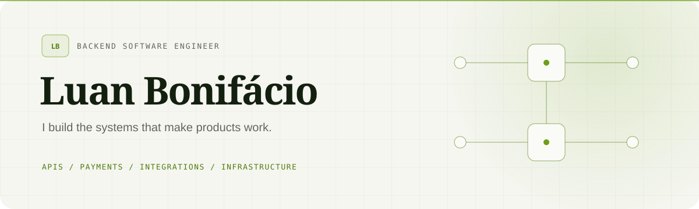

<picture>
  <source media="(prefers-color-scheme: dark)" srcset="./profile/hero-dark.svg">
  <source media="(prefers-color-scheme: light)" srcset="./profile/hero-light.svg">
  
</picture>

<p align="center">
  <a href="https://boniluan.com"><strong>Website</strong></a>&nbsp;&nbsp;·&nbsp;&nbsp;
  <a href="https://lume.boniluan.com"><strong>Lume</strong></a>&nbsp;&nbsp;·&nbsp;&nbsp;
  <a href="https://finpulse.boniluan.com"><strong>FinPulse</strong></a>&nbsp;&nbsp;·&nbsp;&nbsp;
  <a href="https://vigil.boniluan.com"><strong>Vigil</strong></a>&nbsp;&nbsp;·&nbsp;&nbsp;
  <a href="https://relay.boniluan.com"><strong>Relay</strong></a>&nbsp;&nbsp;·&nbsp;&nbsp;
  <a href="https://www.linkedin.com/in/boniluan"><strong>LinkedIn</strong></a>&nbsp;&nbsp;·&nbsp;&nbsp;
  <a href="mailto:bonifacio.luan.10@gmail.com"><strong>Email</strong></a>
</p>

## Hello — I am Luan 👋

I am a backend software engineer focused on the parts of a product that must be **reliable, understandable, and ready for production**. For nearly five years, I have worked with business systems, REST APIs, SQL databases, webhooks, payment integrations, and the infrastructure surrounding them.

My foundation is backend engineering. My next chapter is deeper cloud-native engineering, automation, observability, and distributed systems.

```text
currently_building  →  APIs, integrations, and production-ready services
experienced_with    →  PHP, SQL, payments, Docker, Linux, Nginx, DNS, TLS
growing_toward      →  cloud platforms, CI/CD, observability, distributed systems
```

## What I bring to a system

| Backend & data | Integrations | Production |
| :--- | :--- | :--- |
| PHP · REST APIs | Payments · Pix | Docker · Linux |
| PostgreSQL · MySQL | Webhooks · PSPs | Nginx · TLS · DNS |
| Business rules | External platforms | Deployment · Operations |

I like following a problem beyond the endpoint: from domain rules and data integrity to containers, routing, certificates, logs, and the behavior users actually experience.

## Featured work

### Lume

> A personal-finance platform that makes spending, budgets, and account balances easier to understand and reconcile.

```text
responsive React client  →  versioned FastAPI  →  MariaDB
           ↓                     ↓
quick entry + imports     reports + budget checks
```

Lume is an API-first modular monolith built with Python, FastAPI, SQLAlchemy, MariaDB, React, and TypeScript. It includes secure sessions, user-owned financial data, reviewed CSV/OFX imports, spending insights, account reconciliation, automated tests, and production Docker deployment.

<p>
  <a href="https://lume.boniluan.com"><strong>Open the live application ↗</strong></a>
  &nbsp;&nbsp;·&nbsp;&nbsp;
  <a href="https://github.com/BoniLuan/lume"><strong>Explore the source ↗</strong></a>
</p>

### FinPulse

> A financial assistant that turns Brazilian Central Bank data and backend calculations into useful insights, alerts, and AI-generated explanations.

```text
BACEN & external APIs  →  backend processing  →  PostgreSQL / Redis
                                                ↓
alerts & explanations  ←  Gemini integration  ←  financial calculations
```

FinPulse is where I put architecture into practice: authentication, rate limiting, external APIs, background work, automated tests, containerized services, and production deployment.

<p>
  <a href="https://finpulse.boniluan.com"><strong>Open the live application ↗</strong></a>
  &nbsp;&nbsp;·&nbsp;&nbsp;
  <a href="https://github.com/BoniLuan/finpulse"><strong>Explore the source ↗</strong></a>
</p>

### Vigil

> A self-hosted monitoring and observability platform that runs secure HTTP checks and turns durable execution history into operational insight.

```text
scheduled checks  →  workers  →  PostgreSQL history
       ↓                            ↓
health & latency  ←  metrics  ←  API and operator UI
```

Vigil is built with Go and PostgreSQL as a production-oriented modular monolith. It explores durable scheduling, concurrent workers, safe outbound HTTP, health and readiness checks, metrics, container hardening, and single-VPS operations with Prometheus and Grafana.

<p>
  <a href="https://vigil.boniluan.com"><strong>Open the live project ↗</strong></a>
  &nbsp;&nbsp;·&nbsp;&nbsp;
  <a href="https://github.com/BoniLuan/vigil"><strong>Explore the source ↗</strong></a>
</p>

### Relay

> A webhook delivery service that accepts authenticated events, persists them before acknowledgment, and asynchronously delivers signed HTTPS requests with bounded retries.

```text
authenticated events  →  PostgreSQL  →  delivery worker
                             ↑               ↓
                     attempt history  ←  signed HTTPS webhooks
```

Relay is built with Go and PostgreSQL in one repository, with separate API and worker processes. It explores atomic ingestion, client-scoped idempotency, durable leases, encrypted signing secrets, DNS-pinned HTTPS, and crash recovery. Delivery follows at-least-once semantics: retries have a persisted budget, and receivers must deduplicate using a stable event ID.

The public site explains the architecture and illustrates delivery outcomes; the backend API remains private. Owner-facing delivery history and controlled replay are planned.

<p>
  <a href="https://relay.boniluan.com"><strong>Open the project site ↗</strong></a>
  &nbsp;&nbsp;·&nbsp;&nbsp;
  <a href="https://github.com/BoniLuan/relay"><strong>Explore the source ↗</strong></a>
</p>

## How I work

- **Understand before building.** Start with the domain, constraints, and real user need.
- **Think beyond localhost.** Security, deployment, observability, and maintenance are engineering work.
- **Keep complexity purposeful.** Prefer clear boundaries and boring, dependable solutions.
- **Grow with intention.** Strengthen the backend foundation while expanding toward cloud and automation.

## About this repository

This repository has two jobs: its `README.md` is the introduction shown on my GitHub profile, and its application files power [boniluan.com](https://boniluan.com).

The website uses semantic HTML and CSS served by Nginx on Alpine Linux. Docker Compose also provides Certbot renewal and reverse-proxy routing to FinPulse and Vigil, plus the static Relay project site. To run it in its production-style setup:

```bash
docker network create web-proxy
docker compose up -d --build
docker compose ps
curl --fail --header "Host: boniluan.com" http://127.0.0.1/health
```

TLS certificates and private keys are managed through Docker volumes and are never stored in this repository.

---

<p align="center">
  <sub>Backend · APIs · Payments · Infrastructure</sub><br>
  <sub>Built with care in Brazil.</sub>
</p>

## Relay project page

The edge also serves `https://relay.boniluan.com` using `nginx/relay.conf` and a
read-only `../relay/site` bind. Keep the sibling Relay checkout available before
starting the web service. This is a static institutional site; no Relay API is
proxied. It uses its own `relay.boniluan.com` certificate in the existing Certbot
volume and renewal loop. Deployment checks and rollback are documented in
`../relay/docs/SITE.md`. Other virtual hosts retain their existing routing and TLS.
